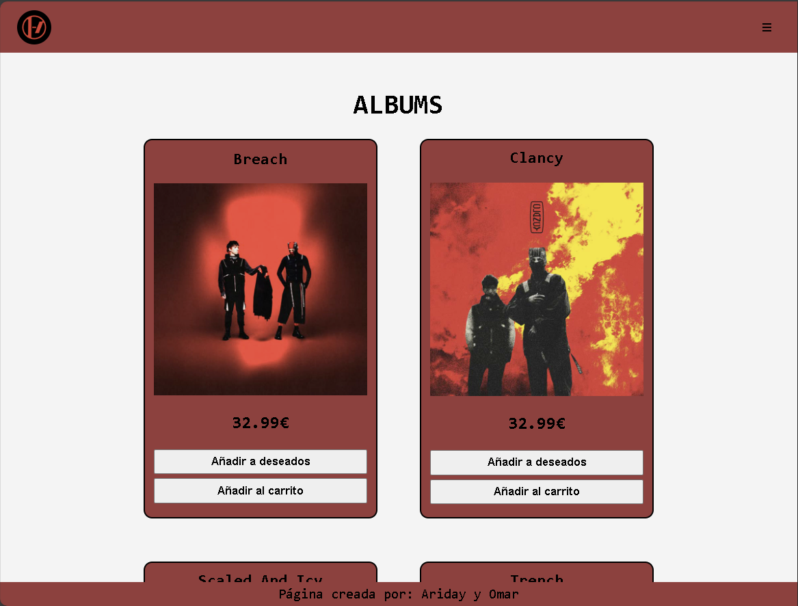
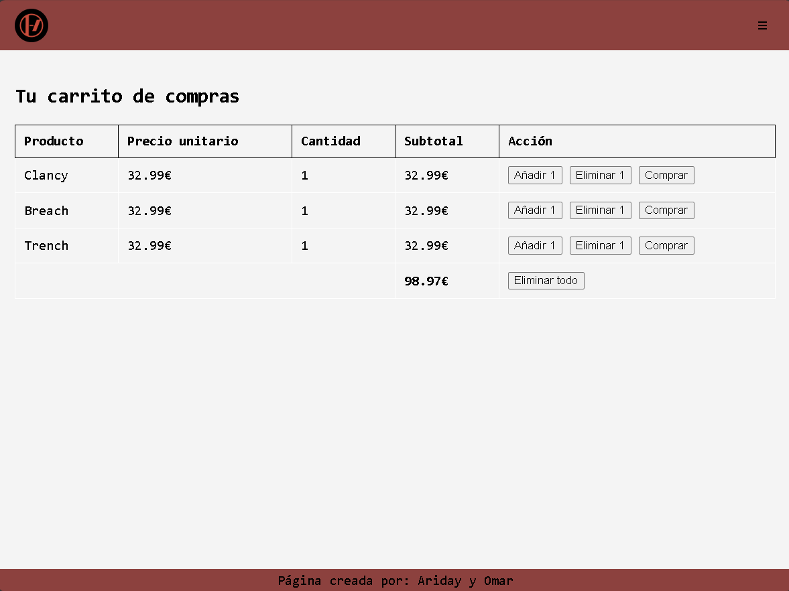
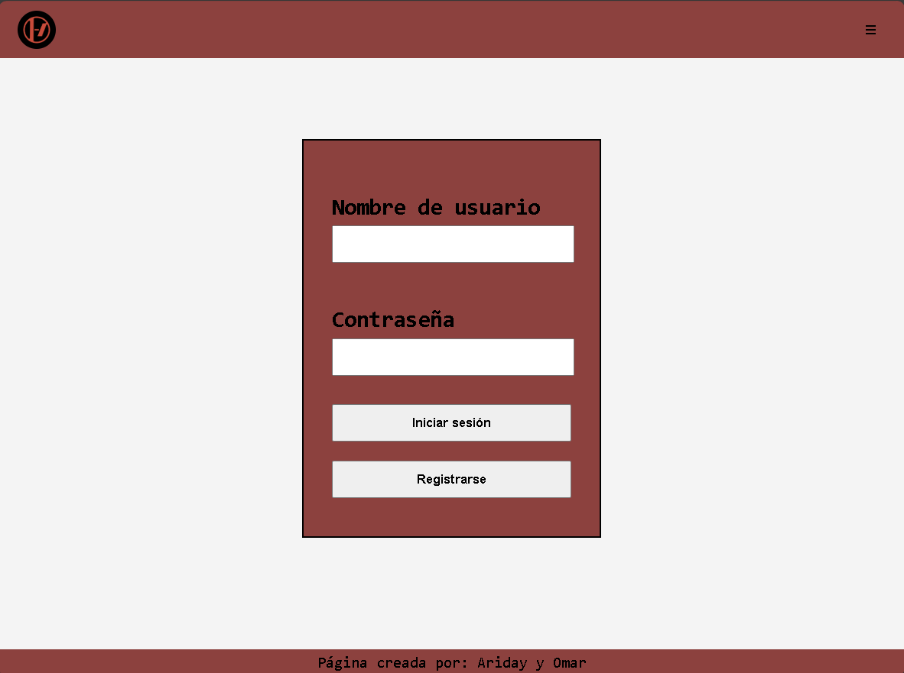
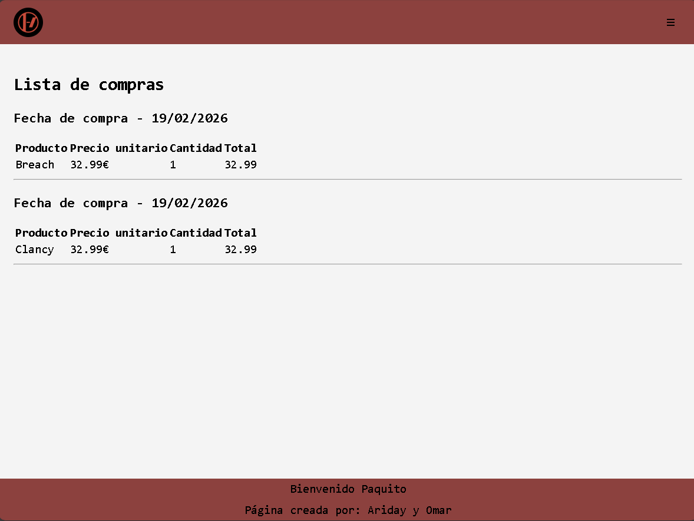

# 🛒 Proyecto Tienda Online

## 📌 Descripción del proyecto

Este proyecto es una **tienda online desarrollada en PHP** que permite a los usuarios navegar por productos, gestionar un carrito de compras, añadir productos a una lista de deseos y realizar compras.  
Incluye funcionalidades de **login**, **gestión de preferencias (idioma y tema)** mediante cookies y un sistema de conexión a base de datos MySQL.

El proyecto está pensado para ejecutarse en un entorno local y sirve como práctica de desarrollo web backend con PHP y base de datos.

---

## 🛠️ Tecnologías utilizadas

- **PHP** (backend)
- **MySQL** (base de datos)
- **HTML5**
- **CSS3**
- **JavaScript**
- **PDO** para la conexión a la base de datos

---

## ⚙️ Instrucciones de instalación y ejecución

### 1️⃣ Requisitos previos

Asegúrate de tener instalado alguno de los siguientes entornos:

- XAMPP / WAMP / MAMP  
- PHP 7.x o superior  
- MySQL  

---

### 2️⃣ Instalación

1. Clona o descarga este repositorio.
2. Copia la carpeta del proyecto en el directorio de tu servidor web:
   - XAMPP → `htdocs`
   - WAMP → `www`

3. Importa la base de datos:
   - Abre **phpMyAdmin**
   - Crea una base de datos llamada:  
     ```sql
     tienda
     ```
   - Importa el archivo:
     ```text
     query tienda.sql
     ```

4. Verifica la conexión a la base de datos en el archivo:
   ```text
   src/BBDD/Conexion.php
   ```
   Configuración por defecto:
   ```php
   $hostDB = '127.0.0.1';
   $nombreDB = 'tienda';
   $usuarioDB = 'root';
   $contraDB = '';
   ```

### 3️⃣ Ejecución
1. Inicia Apache y MySQL desde tu gestor (XAMPP, WAMP, etc.).
2. Accede desde el navegador a:
   ```text
   http://localhost
   ```

3. El archivo `index.php` redireccionará automáticamente a la página principal de la tienda.

### 📸 Capturas de pantalla

- Página principal de la tienda

- Vista del carrito

- Pantalla de login

- Vista de compras

